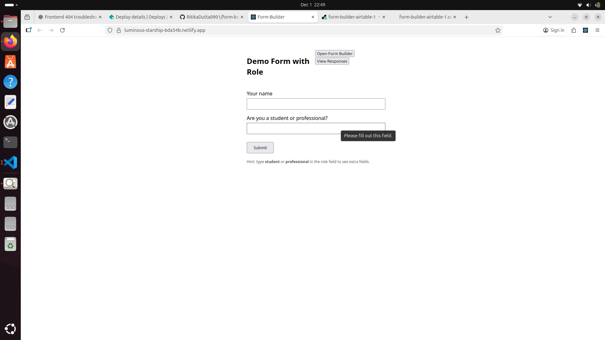
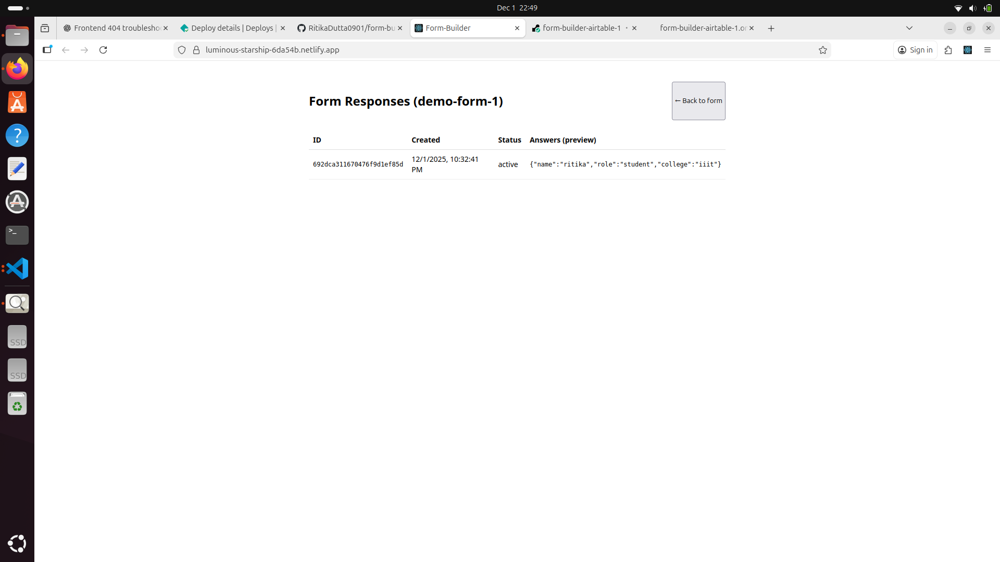
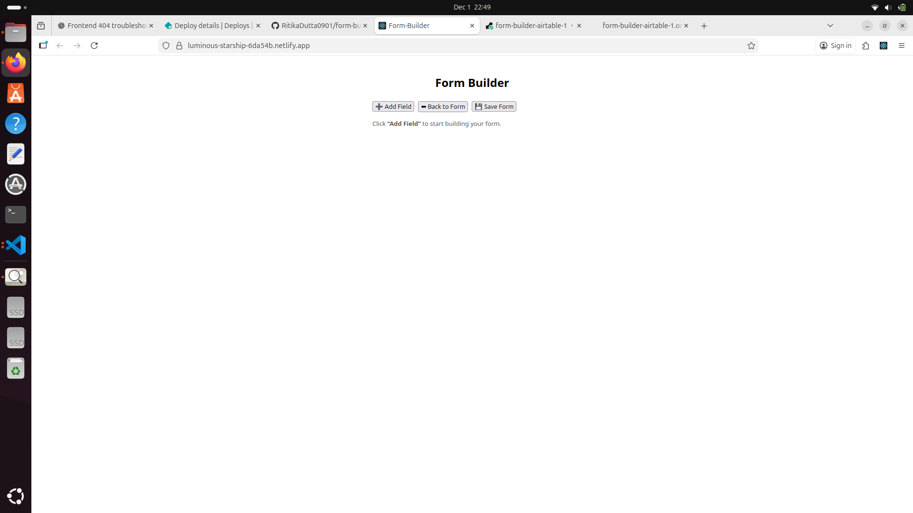

Airtable-Connected Dynamic Form Builder (MERN)

A fully functional Dynamic Form Builder integrated with Airtable OAuth + Airtable Tables, built using MongoDB, Express, React, Node.js.
Users can log in via Airtable, select bases/tables, generate forms dynamically, apply conditional logic, accept responses, sync data with Airtable, and manage submissions inside MongoDB.
Frontend (Netlify)=https://luminous-starship-6da54b.netlify.app
 Backend (Render)=https://form-builder-airtable-1.onrender.com

Core Features
1. Airtable OAuth Login
Secure OAuth authentication
Stores user Airtable profile + access token in MongoDB
Token enables automatic Airtable API access

 2. Form Builder
Select Airtable Base + Table
Build form schema from real Airtable fields
Supported field types:
Short Text
Long Text
Single Select
Multi Select
Attachments

 3. Conditional Logic
Configure question visibility rules
Supported operators → equals | notEquals | contains
Multi-condition groups (AND/OR)

4. Form Rendering
Generates UI dynamically from stored schema
Applies rules live during user input
Required fields & validation included

 5. Submit & Store Responses
Responses are saved in MongoDB + pushed to Airtable.
Saved fields include:
formId
airtableRecordId
answers (JSON)
createdAt
updatedAt

6. Response Dashboard
/forms/:formId/responses
View all submissions (MongoDB only)
Fast retrieval & preview formatting

7. Sync via Airtable Webhooks
Database updates when Airtable record changes:
Event	DB Action
Record Updated	Response updated
Record Deleted	Marked deletedInAirtable: true

Tech Stack
Layer	      Tech
Frontend	  React + JavaScript
Backend	    Node.js + Express
Database	  MongoDB
Integration	Airtable OAuth, REST API, Webhooks
Deployment	Netlify + Render

Setup Instructions
1. Clone Repo
git clone https://github.com/RitikaDutta0901/form-builder-airtable.git
cd form-builder

2️⃣ Backend Setup
cd server
npm install
node src/index.js

3️⃣ Frontend Setup
cd client/frontend
npm install
npm start

login=
response=
builder=

Frontend: https://luminous-starship-6da54b.netlify.app
Backend:  https://form-builder-airtable-1.onrender.com
Repo:     https://github.com/RitikaDutta0901/form-builder-airtable.git

Envioronment Variable Used:
MONGODB_URI=your_mongodb_url_here
AIRTABLE_CLIENT_ID=your_client_id_here
AIRTABLE_CLIENT_SECRET=your_secret_here
AIRTABLE_REDIRECT_URL=your_callback_url_here
AIRTABLE_API_KEY=your_api_key_here
AIRTABLE_BASE_ID=your_base_id_here
AIRTABLE_TABLE_NAME=your_table_id_here

